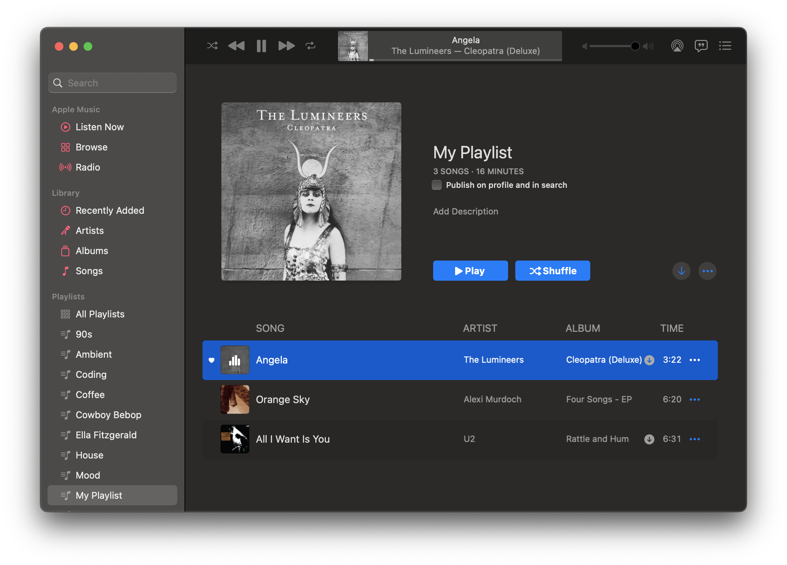
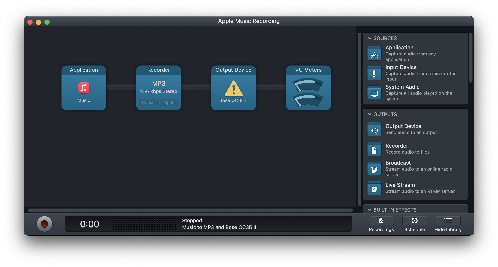
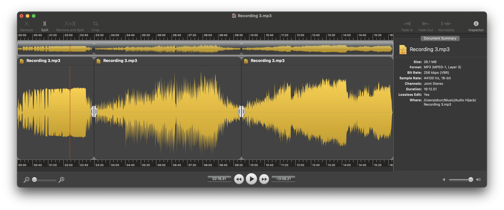
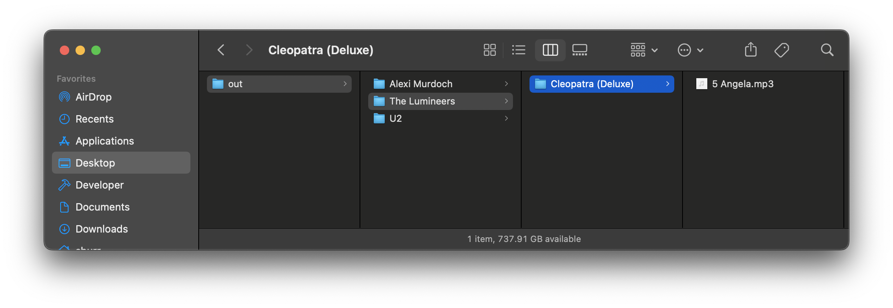

# playlist-utils

A set of convenient utilities for working with iTunes playlists.

In particular, it is useful for taking a series of sequentially named audio files and mapping the information from the playlist onto them as ID3 tags.

This can be used to great effect in conjuction with a workflow something like the following using tools like [Audio Hijack](https://rogueamoeba.com/audiohijack/) and [Fission](https://rogueamoeba.com/fission/) from [Rogue Amoeba](https://rogueamoeba.com):

* Record some stuff into one big `Recording.mp3` file (e.g. in Audio Hijack)
* Split it into a series of sequentially numbered `Recording 1.mp3, Recording 2.mp3, etc...` files (e.g. using the smart split function in Fission)
* Create (unless it already exists because it was the source of the recording in the first place) a playlist that corresponds to that sequence of numbered audio files
* Use the `playlist tags` command to add all of the ID3 tag information and relocate the updated .mp3 files into an `./<Artist>/<Album>/<TrackNum> <Track Title>.mp3` directory structure






## Usage

Example usage

```bash
# we have a playlist, and one big recording which was then split up into 3 smaller slices
# importantly, the order of the slices corresponds to the playlist order
$ ls 
myplaylist.xml
MyAudio.mp3
MyAudio 1.mp3
MyAudio 2.mp3
MyAudio 3.mp3

# notice that there are three songs in our playlist
$ grep key.Name myplaylist.xml
			<key>Name</key><string>Angela</string>
			<key>Name</key><string>Orange Sky</string>
			<key>Name</key><string>All I Want Is You</string>
			<key>Name</key><string>myplaylist</string>

# convert from different playlist formats to JSON just for fun
# and pipe it to the ever useful [json](https://trentm.com/json/) cli utility
$ playlist convert myplaylist.xml | json -a Name
Angela
Orange Sky
All I Want Is You

# add all of the ID3 tag information and relocate the updated .mp3 files
# into an `./<Artist>/<Album>/<TrackNum> <Track Title>.mp3` directory structure 
# (will create the 'out' directory since it does not exist)
$ playlist tags --base-name MyAudio --output-dir out --move-files myplaylist.xml
$ tree out
out/
├── Alexi Murdoch
│   └── Four Songs - EP
│       └── 02 Orange Sky.mp3
├── The Lumineers
│   └── Cleopatra (Deluxe)
│       └── 05 Angela.mp3
└── U2
    └── Rattle and Hum
        └── 17 All I Want Is You.mp3

```

## Installation

1. Ensure you have the `id3tag` utility installed. (macOS: `brew install id3lib`) See project [homepage](https://id3lib.sourceforge.net) for more information about other platforms. _Note: this dependency may be removed in the future._
2. Install the `playlist-utils` NPM package

```bash
yarn global add playlist-utils
```

which should make a `playlist` command available to your shell.

## Discussion

### Caveats using m3u

When exporting playlists from Apple Music, the m3u and m3u8 formats have some quirks. First, they seem to produce empty files if the referenced tracks are not downloaded to your Library. Secondly, they only include limited metadata (just the Artist and the Track title). For these reasons, you may want to prefer the other formats when possible.

### Audio files and base names

The `tags` subcommand will assume audio files are numbered sequentially and start with a common base string (`--base-name`). The default is `Recording` meaning that files like `Recording 1.mp3, Recording 2.mp3, etc...` will be picked up by default. To reference audio files in directory other than the current directory, include the path as part of the base name, as in

```bash
# use audio files /path/to/Base 1.mp3, /path/to/Base 2.mp3, ...
playlist tags --base-name '/path/to/Base' myplaylist.m3u`
```

### Format conversions

The `convert` subcommand just really parses other playlist formats into a common JSON and sends them to stdout.

If you want to support another format, add a parser to the `parsers` directory and then to `parsers/index.coffee` as appropriate. It should just transform the raw playlist file contents into an array of JSON objects.

### Default behavior

The default behavior for a simple 

```bash
playlist tags playlist.xml
```

command would be to

* assume that the audio files are named `./Recording 1.mp3, ./Recording 2.mp3, ...`
* infer the correct playlist format from the `.xml` file extension
* add ID3 tags to the audio files
* and then copy them into folders under the current directory using an `./<Artist>/<Album>/<TrackNum> <Track Title>.mp3` directory structure

## Command line reference

### playlist

```text
Usage: playlist [options] [command]

Process Apple Music playlists

Options:
  -V, --version       output the version number
  -h, --help          display help for command

Commands:
  convert <playlist>  Convert playlist into JSON format
  tags <playlist>     Process and tag audio files with playlist info
  help [command]      display help for command
```

### playlist convert

```text
Usage: playlist-convert [options] <playlist>

Convert Apple Music playlists to JSON

Arguments:
  playlist               Playlist file name to process

Options:
  -f, --format <format>  Playlist format ('json', 'xml', 'txt', 'tsv', 'm3u', 'm3u8') Inferred from file
                         extension if not supplied
  -q, --quiet            Suppress informational output
  -h, --help             display help for command
```

### playlist tags

```text
Usage: playlist-tags [options] <playlist>

Apply the ID3 tags implied by from Apple Music playlist to a sequence of audio files and then move or 
copy those files to a more organized directory structure

Arguments:
  playlist                      Playlist file name to process

Options:
  -d, --output-dir <directory>  Output directory for audio files (default:
                                "/Users/sburr/src/playlist-utils")
  -f, --format <format>         Playlist format ('json', 'xml', 'txt', 'tsv', 'm3u', 'm3u8') Inferred from
                                file extension if not supplied
  -i, --in-place                Update audio files with ID3 tags in place and do not copy, move, or rename
                                them
  -m, --move-files              Actually move the audio files to the output directory
  -n, --base-name <name>        Base filename of the audio files (default: "Recording")
  -q, --quiet                   Suppress informational output
  -h, --help                    display help for command
```

## Technologies used

* [id3tag](https://id3lib.sourceforge.net) because it's pretty reliable and I already had it installed
* [CoffeeScript](https://coffeescript.org) because it actually makes JavaScript palatable
* [commander](https://github.com/tj/commander.js) because TJ
* [csv-parse](https://csv.js.org/parse/) because parsing CSV/TSV is always more of a PITA than it should be
* [plist](https://github.com/TooTallNate/plist.js) because parsing Apple's property list files is almost as much of a PITA as CSV/TSV

## License

MIT
